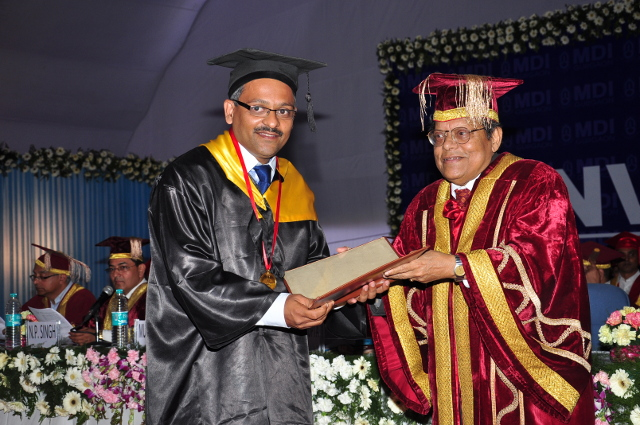
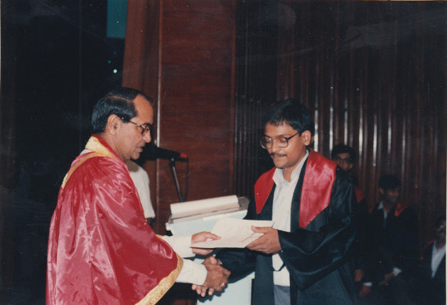

###PGDBM (Part time), Management Development Institute, Passout 2013, [Gold Medalist](pgpm_credentials.html)

 

(Dr. Nitish K Sengupta, Chief Guest at Convocation 2013, MDI, Gurgaon)

 

Vineet finished his PGPM ( [Post Graduate Program In Management - Part Time](http://www.mdi.ac.in/executive-post-graduate-programmes/part-time-post-graduate-programme-in-management.html), AICTE approved) from M.D.I. Gurgaon in 2013 March. [36 subjects](thirty-six-subjects.html) with every subject having 30 contact hours. He did his major in Marketing and minor in Finance.

He earned Gold Medal in this course. His dissertation was on consumer behaviour for online purchase.

He was in job for [16 years](../careers) and left it to experiment with entrepreneurship. Unfortunately, it did not workout, the way he had seen it. Doing MBA, was a challenging not very optimistic scenario. Strict discipline at college, rigorous course execution, late evening hours classes, all contributed to bring in useful transformation and developed a perspective to doing business.

He had earlier attempted the same course in 1999, 2003 and had to leave it in between, giving priority to job and family at that time. This time, it was family and studies.

Some of the [pearls of wisdom](pearls-of-wisdom.html) can be see here. These are collected from classes of respected professors, who were great in delivering the knowledge and connecting us with business realities through case studies, workshops, guest lectures, project work besides academic activities of quiz/exams.

###B.E. Electronics and Electrical Communications, Punjab Engineering College, Passout 1994, [Honours](be_electronics_creds.html)

 

(Convocation 1994, Prof. Rajnish Prakash, Principal, Punjab Engineering College, Chandigarh)

 

Vineet Kumar Maheshwari has done his engineering in Electronics from Punjab Engineering College, Chandigarh (now known as [PEC University of Technology](http://pec.ac.in)), ranked #5 by the Outlook India Top Engineering Colleges of 2012. He passed out in 1994. He and few of his friends, where one stands very close, Puneet Goel, did several minor and few major projects during 3rd and final year (1993-1994). These projects were around micro-controller 8051. His enthusiasm and association with a very close friend, [Puneet Goel](https://www.linkedin.com/pub/dir/Puneet/Goel) helped them to create small lab at home during those days. They had developed kit and experiment with learnings in the area of digital electronics, software (assembly, c).

Prof. V. Rihani was a great support in promoting their technology passion and within that for processors and digital electronics. He enabled us to take professional projects in final year as part of the major projects.

###Six Sigma Black Belt - Training
Vineet, in 2010, opted for 12-days course with QAI to get trained on Six Sigma. He had strong believe in processes and their role to make a self-sustaining organization with continuous improvements. Processes when understood in detail, have dependency on metrics and statistical analysis. This is where, he found Six Sigma an enabler for any future application. He has interest in Statistics which also aligns well with this need. Learnt this again while he studied at MDI.

### PMP Certification
Vineet, did his PMP certification in 2009. Later in 2010, he got an opportunity to present paper as well in PMI National Conference at Mumbai.